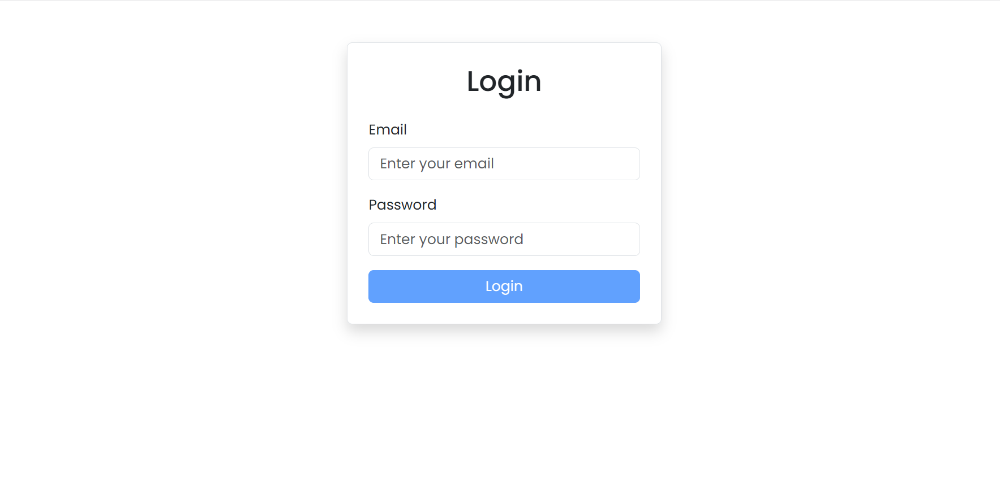

# **React Form Practice**

This is a practice project focused on implementing and handling forms with **React Hook Form** and **Yup** for validation. The project includes both **Login** and **Sign-Up** forms to showcase best practices for form validation in React.

## **Features**
- **Form Validation**: Built with `Yup` to handle field validation (e.g., email format, password strength).
- **React Hook Form**: Utilized for managing form states and submission.
- **Bootstrap**: For easy UI styling.
- **Conditional Rendering**: Handles error and success messages for form submissions.
- **Responsive Design**: Ensures forms are mobile-friendly using Bootstrap's grid system.

## **Technologies Used**
- **React**: JavaScript library for building user interfaces.
- **React Hook Form**: A performant form library to manage forms in React.
- **Yup**: Schema builder for form validation.
- **Bootstrap**: Frontend framework for styling.
- **Vite**: A modern frontend toolchain for fast development.

## **Project Structure**
```
/src
  /assets                 
  /pages
    /Login                
      - Login.jsx
    /SignUp               
      - SignUp.jsx
  App.jsx                 
  index.css               
  main.jsx                

.gitignore               
.eslint.config.js       
index.html               
package-lock.json        
package.json            
README.md                
vite.config.js          

```

## **Installation**

### 1. Clone the repository

```bash
git clone https://github.com/Choubi-Mohammed/React-Form-Practice.git
cd React-Form-Practice
```

### 2. Install dependencies

Make sure you have **Node.js** and **npm** installed. You can download them from [Node.js official website](https://nodejs.org/).

Run the following command to install all dependencies:

```bash
npm install
```

### 3. Run the application

Start the development server to see the project in action:

```bash
npm run dev
```

This will start the application on `http://localhost:3000`.

## **Usage**

This project consists of two main forms: **Login** and **SignUp**.

### **Login Form**

- **Email** and **Password** fields.
- Validation with `Yup` to check:
  - Correct email format.
  - Password length must be at least 8 characters.



### **Sign-Up Form**

- **Name**, **Email**, and **Password** fields.
- Validation with `Yup` to check:
  - Name should be at least 3 characters.
  - Email must be a valid email.
  - Password should be at least 8 characters long.


Both forms use **React Hook Form** for efficient form management, and display real-time validation feedback based on the form's validity.

## **Contributing**

Feel free to fork the repository, submit pull requests, or raise issues for improvements.

## **License**

This project is licensed under the MIT License.
